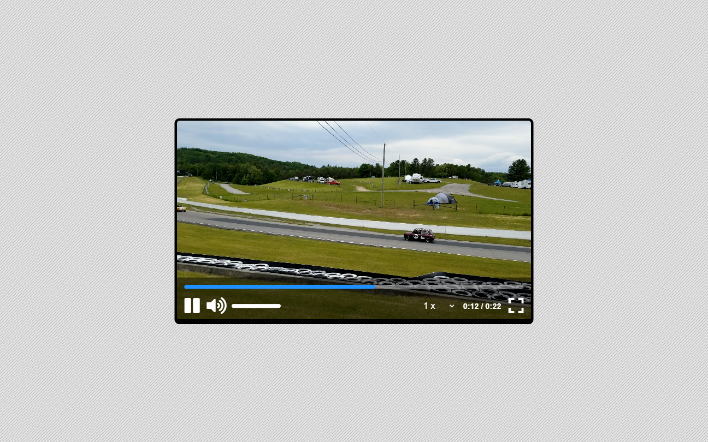

# Video Player | ZTM JS Web Projects Course

**Project 11/20**

🎬 Custom Video Player is a sleek, fully functional HTML5 video player built from scratch with JavaScript. It features a modern UI and advanced media controls including custom playback speed, volume control, fullscreen toggle, and interactive progress tracking — all wrapped in a responsive and stylish design. A solid step toward mastering DOM manipulation and media APIs!

---

## 📚 Table of Contents

- [🔎 Overview](#-overview)
  - [📸 Screenshot](#-screenshot)
  - [🔗 Links](#-links)
  - [📌 Features](#-features)
- [🧠 My process](#-my-process)
  - [🛠️ Built with](#️-built-with)
  - [🎓 What I learned](#-what-i-learned)
  - [🔙 Previous Project](#-previous-project)
  - [🔜 Next Project](#-next-project)
  - [🗃️ Useful resources](#️-useful-resources)
- [👤 Author](#-author)
  - [🌐 Connect with Me](#-connect-with-me)
  - [💻 Coding Profiles](#-coding-profiles)

---

## 🔎 Overview

### 📸 Screenshot

### 🔗 Links

 - [🔴 Live Demo](https://dalascript.github.io/projects-title/)
 - [🗂️ GitHub Repository](https://github.com/DalaScript/projects-title)

### 📌 Features

 - ✅ Custom play/pause controls with animated icons
 - ✅ Interactive progress bar for seeking through the video
 - ✅ Volume slider with dynamic icon updates and mute/unmute toggle
 - ✅ Playback speed options (0.5x to 2x)
 - ✅ Fullscreen toggle support with cross-browser compatibility
 - ✅ Real-time display of elapsed time and duration
 - ✅ Responsive layout with media query support for mobile devices
 - ✅ Styled hover interactions for an intuitive user experience

---

## 🧠 My Process

### 🛠️ Built with

 - HTML5
 - CSS3
 - Vanilla JavaScript
 - Video API

### 🎓 What I Learned

 - Working directly with the HTML5 video API for full control
 - Building custom controls and syncing UI with video state
 - Creating volume and progress bars using precise math and layout techniques
 - Implementing fullscreen logic across different browsers
 - Formatting timestamps and updating the interface in real time
 - Structuring clean, reusable event-driven JavaScript
 - Designing responsive and accessible video players from scratch

  > 🚀 For me, this project was more about **practice** and gaining additional **experience**,  
  > rather than learning something entirely new.  
  >  
  > 👨‍💻 Since I’m not a beginner and already familiar with these technologies,  
  > I approached it with confidence — and still, I truly **enjoyed working on it**.  
  >  
  > 🎯 Overall, I consider this a very **valuable and enjoyable experience**.

### 🔙 Previous Project

 - Book Keeper | *[Project 10/20]* → [View Repository](https://github.com/DalaScript/book-keeper)

### 🔜 Next Project

 - Form Validator | *[Project 12/20]* → [View Repository](https://github.com/DalaScript/form-validator)

### 🗃️ Useful resources

 - [pixabay](https://pixabay.com/) - free videos
 - [mixkit](https://mixkit.co/) - free videos
 - [fontawesome](https://fontawesome.com/icons) - free icons
 - [calc()](https://developer.mozilla.org/en-US/docs/Web/CSS/calc) - The CSS calc() function
 - [<select>](https://developer.mozilla.org/en-US/docs/Web/HTML/Reference/Elements/select) - The HTML Select element
 - [HTML Audio/Video](https://www.w3schools.com/tags/ref_av_dom.asp) - HTML Audio and Video DOM Reference
 - [change event](https://developer.mozilla.org/en-US/docs/Web/API/HTMLElement/change_event) - HTMLElement: change event
 - [Fullscreen](https://www.w3schools.com/howto/howto_js_fullscreen.asp) - How TO - Fullscreen
 - [Browser detection](https://developer.mozilla.org/en-US/docs/Web/HTTP/Guides/Browser_detection_using_the_user_agent) - Browser detection using the user agent string (UA sniffing)
 - [Chrome's UA header](https://security.stackexchange.com/questions/126407/why-does-chrome-send-four-browsers-in-the-user-agent-header) - Why does Chrome send four browsers in the user-agent header?

---

## 👤 Author

### 🌐 Connect with Me

 - [Instagram](https://www.instagram.com/DalaScript)
 - [YouTube](https://www.youtube.com/@DalaScript)

### 💻 Coding Profiles

 - [freeCodeCamp](https://www.freecodecamp.org/DalaScript)
 - [FrontendMentor](https://www.frontendmentor.io/profile/DalaScript)
 - [GitHub](https://github.com/DalaScript)

*🙌 Thanks for checking out my project! More coming soon. Stay tuned 🚀*